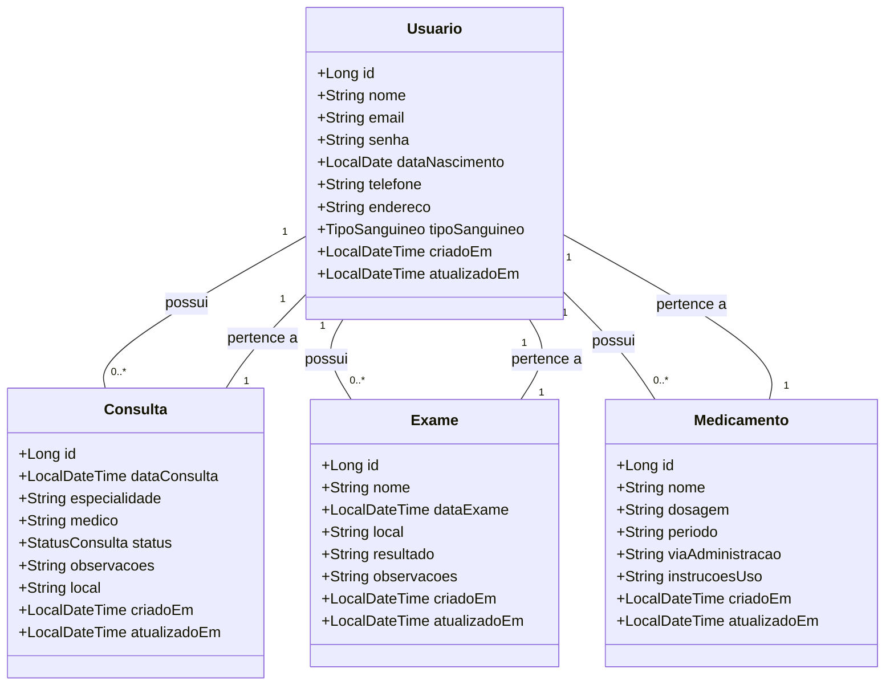

<p align="center">
	

 

  
  <h1 align="center"> 🩺 Saúde Hub  </h1>
  
<p align="center">
 <a href="#-sobre-o-projeto">Sobre</a> •
 <a href="#-funcionalidades">Funcionalidades</a> •
 <a href="#-modelagem-do-sistema">Modelagem do sistema</a> • 
 <a href="#-como-executar-o-projeto">Como executar</a> • 
<a href="#-deploy">Deploy</a> • 
 <a href="#-tecnologias">Tecnologias</a> •  
 <a href="#licença">Licença</a>
</p>

## 📄 Sobre o Projeto
<p> 
	O SaúdeHub é um sistema de agenda pessoal focado na saúde, ajudando você a organizar consultas, exames e medicamentos de forma prática. Com ele, você pode registrar compromissos médicos, acompanhar exames pendentes e definir lembretes para seus medicamentos, garantindo um melhor controle do seu tratamento.<br><br>
Fácil de usar e seguro, o SaúdeHub reúne tudo o que você precisa para manter sua saúde em dia, em um só lugar! 🚀💙
</p>

## ⚙️ Funcionalidades

O SaúdeHub oferece as seguintes funcionalidades para o gerenciamento de informações de saúde:

* Cadastrar usuários
* Gerenciar consultas, exames e medicamentos

### Usuários (usuários)
- `GET /usuarios`: Retorna todos os usuários.
- `GET /usuarios/:id`: Retorna um usuário pelo ID.
- `GET /usuarios/nome/{nome}`: Retorna um usuário pelo nome.
- `POST /usuarios`: Cadastra um novo usuário.
- `PUT /usuarios/atualizar/:id`: Atualiza um usuário pelo ID.
- `DELETE /usuarios/:id`: Deleta um usuário pelo ID.

### Consultas (consultas)
- `GET /consultas`: Retorna todas as consultas.
- `GET /consultas/:id`: Retorna uma consulta pelo ID.
- `GET /consultas/status/{status}`: Retorna uma consulta por status.
- `POST /consultas`: Registra uma nova consulta.
- `PUT /consultas/:id`: Atualiza uma consulta pelo ID.
- `DELETE /consultas/:id`: Deleta uma consulta pelo ID.

### Exames (exames)
- `GET /exames`: Retorna todos os exames.
- `GET /exames/:id`: Retorna um exame pelo ID.
- `GET /exames/nome/{nome}`: Retorna um exame pelo nome.
- `POST /exames`: Registra um novo exame.
- `PUT /exames/:id`: Atualiza um exame pelo ID.
- `DELETE /exames/:id`: Deleta um exame pelo ID.

### Medicamentos (medicamentos)
- `GET /medicamentos`: Retorna todos os medicamentos.
- `GET /medicamentos/:id`: Retorna um medicamento pelo ID.
- `GET /medicamentos/nome/{nome}`: Retorna um medicamento pelo nome.
- `POST /medicamentos`: Registra um novo medicamento.
- `PUT /medicamentos/:id`: Atualiza um medicamento pelo ID.
- `DELETE /medicamentos/:id`: Deleta um medicamento pelo ID.

Esses endpoints ajudam a centralizar e gerenciar todas as informações de saúde, mantendo o usuário no controle total de seus cuidados.

## 💾 Modelagem do sistema
### Diagram de Classes

### Diagrama Entidade-Relacionamento (DER)


## ⚡ Como executar o projeto
### Pré-requisitos
Antes de começar, você vai precisar ter instalado em sua máquina as seguintes ferramentas:

- Java 21 ou versão superior
- Maven (ou Gradle, dependendo do seu gerenciador de dependências preferido, caso esteja utilizando outro)
- MySQL 
- IDE como IntelliJ IDEA ou Eclipse 

### Agora é só seguir os seguintes passos:
```bash
# CLone este repositório
$ git clone git@github.com:seu-perfil/saude-hub.git

# Acesse a pasta do projeto no terminal/cmd
$ cd saude-hub

# Instale as dependências 
$ mvn clean install

# Altere as informações do banco de dados no application-dev.properties
spring.datasource.username=seu-username
spring.datasource.password=sua-senha

# Altere para o perfil dev no arquivo application.properties
spring.profiles.active=dev

# Execute a aplicação pelo SaudeHubApplication.java
$ run 
```
A aplicação estará disponível em `http://localhost:8080` juntamente com o swagger.

### **Observação:**
#### Alternando entre os perfis no arquivo application.properties
Para alternar entre as configurações Local e Remota, abra o arquivo application.properties e utilize uma das 2 opções abaixo:
- spring.profiles.active=dev 🡢 O Spring executará a aplicação com a configuração do Banco de dados local (MySQL)
- spring.profiles.active=prod 🡢 O Spring executará a aplicação com a configuração do Banco de dados na nuvem (Render)

## 🚀 Deploy
O deploy da aplicação está disponivel [neste link](https://saudehub.onrender.com)


## 🛠 Tecnologias


## 📝Licença

Feito com ❤️ por Vanessa Ribeiro 👋🏽 [Entre em contato!](https://www.linkedin.com/in/vanessaribeiro-/)

